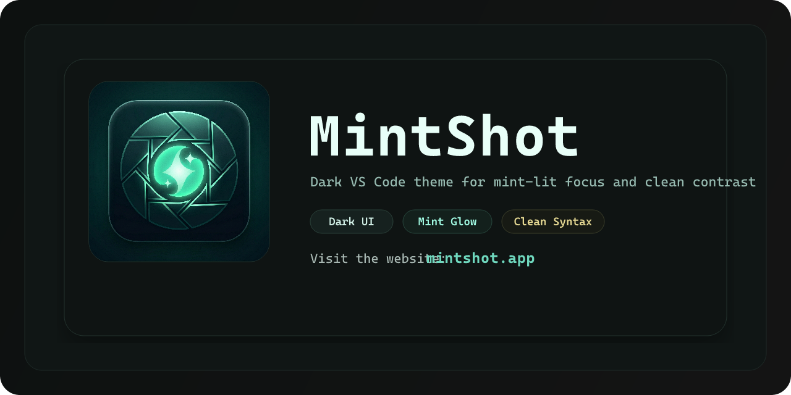

# MintShot



MintShot is a dark VS Code theme with mint-accented UI colors, soft contrast, and bright syntax highlights designed to stay readable during long coding sessions.

## What it looks like

MintShot is built around:

- a deep dark background
- mint and sea-green accent colors
- bright function and symbol highlighting
- low-glare panels, tabs, and sidebars

## Install

### From the VS Code Marketplace

Once published, search for `MintShot` in the Extensions view and install it like any other VS Code theme.

### From a `.vsix` file

1. Download the latest `.vsix` from the repo's releases.
2. In VS Code, run `Extensions: Install from VSIX...`.
3. Select the downloaded file.
4. Open `Preferences: Color Theme` and choose `MintShot`.

## Development

To work on the theme locally:

1. Open this repo in VS Code.
2. Press `F5` to launch an Extension Development Host.
3. In the new window, open `Preferences: Color Theme`.
4. Select `MintShot`.

To package the extension locally:

```bash
npm run package
```

This creates a `.vsix` you can install manually or attach to a GitHub release.

## Publishing

This repo targets the VS Code Marketplace.

### Manual publish

```bash
npm run publish:vsce
```

### GitHub Actions publish

The included GitHub Actions workflow can package and publish the extension when the `VSCE_PAT` repository secret is configured.

## Repo structure

- `package.json` contains extension metadata and publish/package scripts.
- `themes/mintshot-dark-color-theme.json` contains the theme definition.
- `.github/workflows/publish.yml` contains the release workflow.

## License

MintShot is released under the MIT License.
